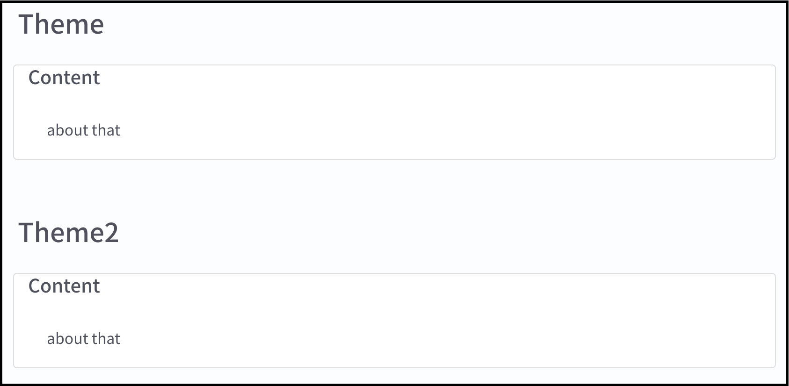

# PortfolioSample
徳大知情M1後期輪講　Webフロントエンド作成入門　演習用サンプルコード

## Preparation

  1. Download this project from '**Clone or download▼**'. And decompress it.
  2. Show 'sample/index.html' and 'practice/index.html' at _**Firefox**_.
  3. Open downloaded directory with _**Visual studio code**_.
  4. 'practice/*' are your work files.

## Totrial
### 1. Adapt the layout to some classes with follows:
  - .port-title
    - Set font size to 40px
    - Set text alignment to center
    - Set letter spacing to 8px
    - Set margin top and bottom to 40px
  - .port-description
    - Set text alignment to center
    - Set letter spacing to 4px

### 2. Adapt class name "_card_" and so on to content box.
This process using bootstrap's component **card**.

### 3. Copy box classed "_port-content_" and under that.
  You should change class name from "_port-item1_" to "port-[item name]"

### 4. Change content color to color of your choice.
#### For example
  - .port-item1
    - Set background color to rgb(65, 215, 230);
  - .port-[second item name]
    - Set background color to rgb(162, 120, 190);
  - .port-content-title
    - Set text color to white

### 5. Prepare footer design.
  - Set class name "_btn_" to object '**a**'
  - Set button design to follows:
    - Set class name "_btn-primary_" to button 'Twitter'
    - Set class name "_btn-secondary_" to button 'GitHub'

  - Layout buttons using bootstrap's **coutainer-row-column**.
  - Set class name "_justify-content-around_" to row box.
  - footer
    - Set padding top and bottom to 20px

### 6. Create yourself!
